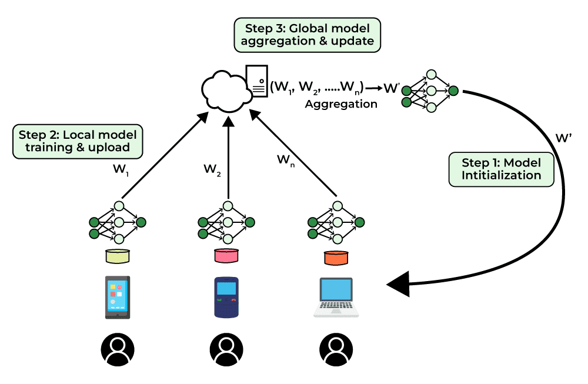
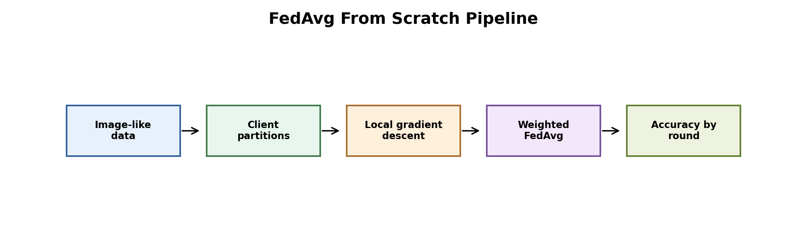
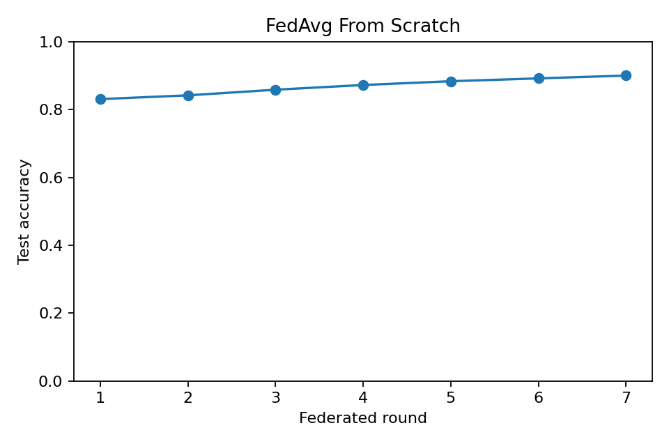
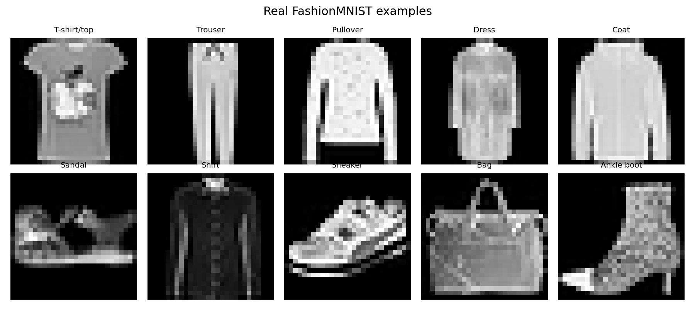

# Federated Averaging from Scratch on FashionMNIST



Figure: clients train local models, upload updates, and the server aggregates them into a new global model.



Figure: real FashionMNIST images are split across clients, trained locally, and aggregated with FedAvg.

## Motivation

Federated Averaging is more meaningful when tested on a real dataset and compared under IID and non-IID client splits. This project uses real FashionMNIST to show how client label imbalance changes training behavior.

## Project Goal

We implemented FedAvg from scratch for multiclass logistic regression and compared IID versus non-IID clients on real FashionMNIST.

## Dataset

We used the real FashionMNIST IDX files from Zalando Research.

- Training subset: 6,000 images
- Test subset: 2,000 images
- Classes: 10 fashion categories
- Image size: 28x28 grayscale
- Clients: 6

The raw dataset is downloaded into `data/`, which is ignored by Git.

## Tools

Python, NumPy, pandas, matplotlib, and a from-scratch softmax classifier.

## Method

Each client trains a local softmax classifier for two local epochs. The server averages client weights by client sample count. We tested:

- IID split: every client has all 10 classes
- Non-IID split: clients see only a subset of classes

## Hyperparameters

| Setting | Value |
|---|---:|
| Federated rounds | 10 |
| Local epochs | 2 |
| Learning rate | 0.35 |
| Clients | 6 |
| Train images | 6,000 |
| Test images | 2,000 |

## Results

| Round | IID Accuracy | Non-IID Accuracy |
|---:|---:|---:|
| 1 | 0.4400 | 0.1000 |
| 5 | 0.5410 | 0.2745 |
| 10 | 0.6855 | 0.6470 |





Result files:

- `results/fedavg_metrics.csv`
- `results/client_sizes.csv`
- `results/experiment_setup.csv`

## Interpretation

IID clients learn faster because each client sees all classes. Non-IID clients start much worse because each client only observes part of the label space, so local updates are biased toward local classes.

By round 10, non-IID accuracy improves to 64.70%, but it remains slightly below IID accuracy at 68.55%. The curve is also less stable. This is a realistic federated learning issue.

## Conclusion

This project uses real FashionMNIST and shows why non-IID data matters. FedAvg can still learn, but client label imbalance slows and destabilizes training.

## How To Run

```bash
pip install -r requirements.txt
python 1_real_fashionmnist_fedavg.py
```
